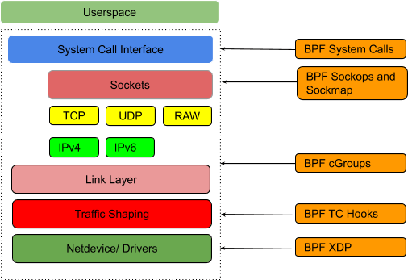

# Tutorial of eBPF


To record the process of learning eBPF.
## Table of Contents

- [Tutorial of eBPF](#tutorial-of-ebpf)
  - [Table of Contents](#table-of-contents)
  - [eBPF](#ebpf)
  - [Hooks](#hooks)
  - [Steps](#steps)
    - [1.1 write the eBPF program with c](#11-write-the-ebpf-program-with-c)
    - [1.2 use clang to generate bytecode](#12-use-clang-to-generate-bytecode)
    - [1.3 use front end tools to load the bytecode](#13-use-front-end-tools-to-load-the-bytecode)
    - [1.4 check the result](#14-check-the-result)
  - [More materials](#more-materials)

## eBPF

The original Berkeley Packet Filter (BPF) was designed for capturing and filtering network packets that matched specific rules. Filters are implemented as programs to be run on a register-based virtual machine.

[BPF and XDP Reference Guide](https://docs.cilium.io/en/stable/bpf/)

## Hooks

<div align="center" style="text-align:center"> 
</div>
<div align="center">Fig 1.2 eBPF hooks in kernel</div>

## Steps

### 1.1 write the eBPF program with c

tc-example.c

### 1.2 use clang to generate bytecode

```bash
clang -O2 -Wall --target=bpf -c tc-example.c -o tc-example.o
```

### 1.3 use front end tools to load the bytecode

There are various front ends for loading BPF programs into the kernel such as bcc, perf, iproute2 and others.
```bash
# example of loading of tc BPF object files
sudo tc qdisc add dev eth0 clsact
sudo tc filter add dev eth0 ingress bpf da obj tc-example.o sec ingress
sudo tc filter add dev eth0 egress bpf da obj tc-example.o sec egress

# to clean up
sudo tc qdisc del dev eth0 clsact
```

### 1.4 check the result

```bash
# show the filter
sudo tc filter show dev eth0 ingress
filter protocol all pref 49152 bpf chain 0
filter protocol all pref 49152 bpf chain 0 handle 0x1 tc-example.o:[ingress] direct-action not_in_hw id 10639 tag b64e1340ad737431 jited

# check the print from the trace pipe
sudo tc exec bpf dbg

# or list the loaded programs
sudo bpftool prog list

# or 
sudo bpftool net show

```

## More materials

eBPF program types: [tc (traffic control)](https://docs.cilium.io/en/stable/bpf/progtypes/#tc-traffic-control)